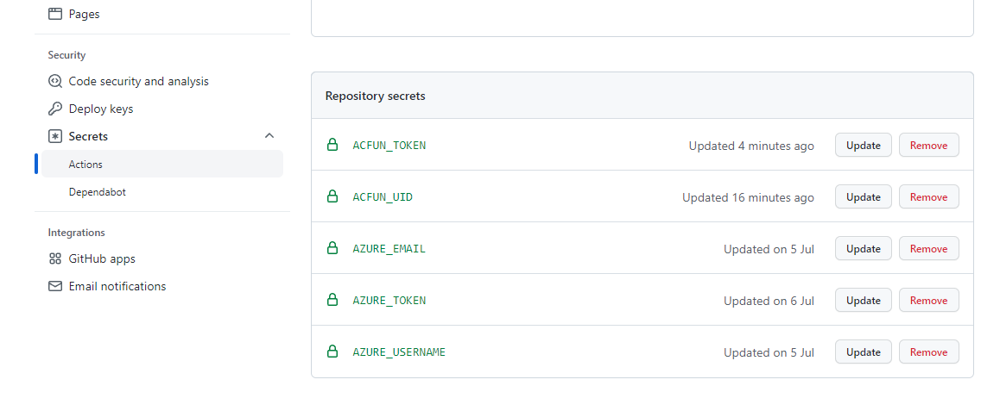

#### 介绍

索引自己上传到Acfun的视频地址

#### 软件架构

nodejs 14+

#### 使用方法

1. 打开Chrome浏览器登录Acfun
2. 打开Chrome的开发者工具->Network标签
3. 打开 https://member.acfun.cn/video-history
4. 将这个网络请求复制为Fetch文本数据再提取headers->cookie这个字段的数据放入环境变量ACFUN_COOKIES，后续所有网络请求都会使用这些cookies，见下文图1，图2
5. 执行命令安装运行环境 `npm install` 或 `yarn`
6. 执行命令启动脚本`npm run start`或`yarn run start`

本项目使用Github Actions，每小时第30分钟会自动化执行

图1

图2，只需要将cookie这个字段的文本放入环境变量 ACFUN_COOKIES 即可
