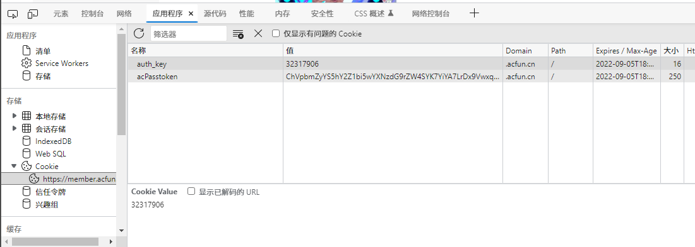

#### 介绍

索引自己上传到Acfun的视频地址

#### 软件架构

nodejs 14+

#### 使用方法

1. 打开Chrome浏览器登录Acfun
3. 浏览器打开网页 https://member.acfun.cn/video-history
4. 将图1的acPasstoken和auth_key分别添加到图2(Github项目的机密变量)中的ACFUN_UID(auth_key)、ACFUN_TOKEN(acPasstoken)
5. 执行命令安装运行环境 `npm install` 或 `yarn`
6. 执行命令启动脚本`npm run start`

***本项目使用Github Actions，会定时自动化执行***

#### 图1

#### 图2

